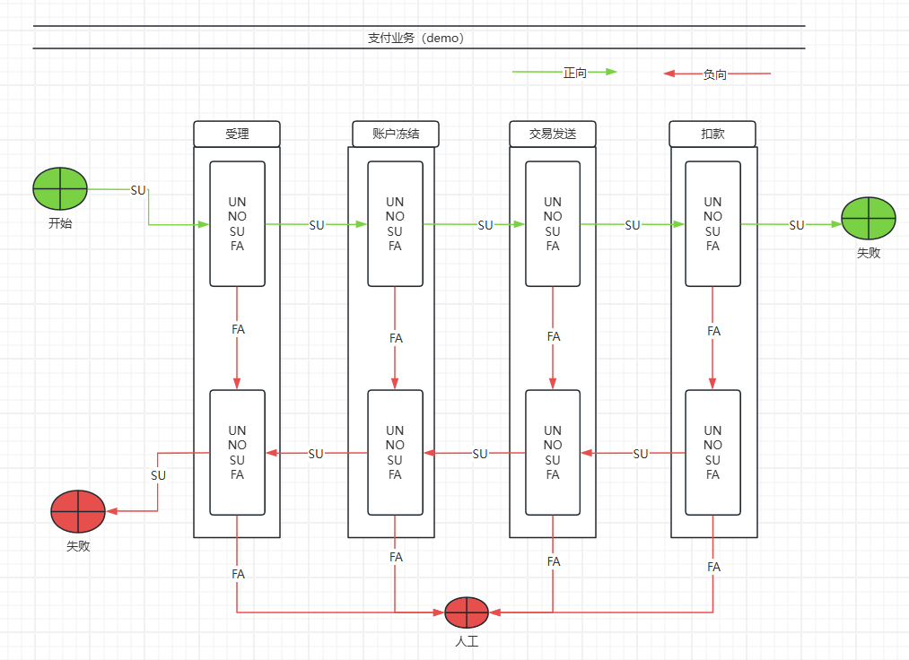
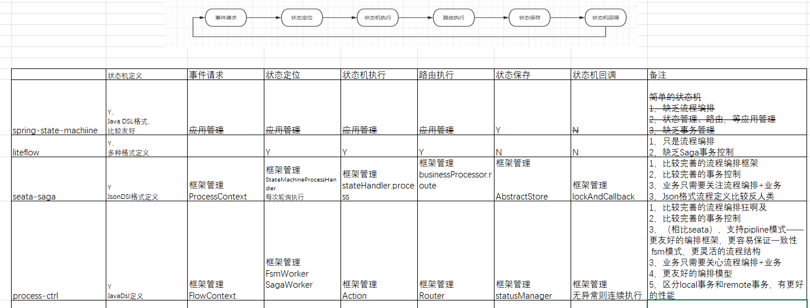

# saga模式介绍

论文：https://www.cs.cornell.edu/andru/cs711/2002fa/reading/sagas.pdf

按saga规范，一个典型的saga业务应该如下架构

在实现上，实现了两套

1，saga模式是标准saga模式定义的。是pipeline结构的，容易保证一致性，缺点是不适用于非常复杂的流程

2，fsm模式自由的工作流结构，适应于非常复杂的流程接口，缺点是回滚时必须确保按照原执行路径回溯，需要比较复杂的事件溯源机制确保一致性。否则在特殊情况下不能保证回滚一致性。

# saga模式的优缺点

**和非saga框架的比较**

    优点
    1，长事务拆分为N个短事务，有比较好的性能 
    2，针对长流程、复杂业务；基于流程编排的saga在可维护性、可扩展性上优势明显
        DB事务/XA事务在长流程、异步复杂业务上不支持
        事务消息没有统一接口、依赖开发自身能力
        tcc缺乏对整体流程的编排、管理

    缺点
    1，每个节点业务执行完毕直接提交，隔离性比较差、需要业务代码来处理脏读的问题
    2，回滚事务有业务侵入性
            DB事务对业务透明
            XA对业务透明透明
            事务消息同SAGA，需要应用自己补偿
            TCC同SAGA，需要应用Commit/Rollback

**和saga框架的比较**

 
1，Seata没有做防悬挂和空提交

2，Seata的Saga实现是依据pipeline模式的，也没有实现事件溯源机制，仅适用于比较简单的直线型业务结构。
 
对于流程变化比较多的自由流程，回滚不能按照执行顺序逆序执行，不能严格回滚保证一致性。

3，API易用性优化
    3.1 json dsl编排业务，难写难调易错；改为JavaDSL风格，有代码强校验，更容易写出健壮的代码。
    3.2 action包含正向和逆向业务业务，容易确保一致性。
 

 
# 最佳实践

     
    1，长流程、复杂业务应该：组件化、积木化、可编排
    2，每个积木内应该包含正向业务和负向业务两套接口，确保回滚一致性
    3，每个业务的执行步骤统一为一套标准状态机UN，SU，FAIL，NONE（Seata缺乏此状态）；长流程业务是N个统一接口的、可重复执行的标准状态机的叠加。
    4，状态机统一管理整体：流程、路由、事件机制等，定义各个组件的输出入。业务逻辑仅负责继承接口，按输出入处理局部逻辑。
    5，通过mock框架，可以在业务逻辑没有开发的时候，验证整个流程的可用性和健壮性。

参考资料

https://github.com/Azure-Samples/saga-orchestration-serverless

https://it.sohu.com/a/788243516_121389665

https://help.aliyun.com/document_detail/181208.html