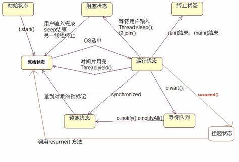
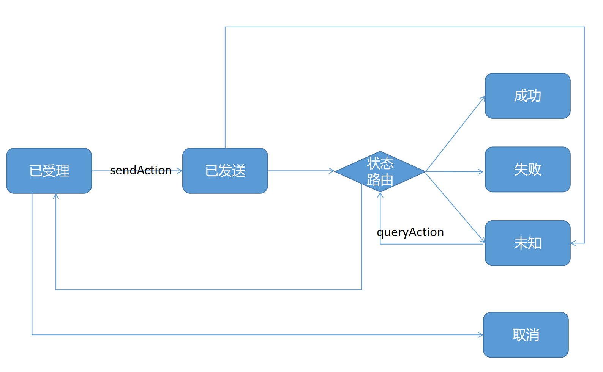

# 复杂长业务流程

如图，是一个典型的复杂长业务流程。

# 问题

这种长流程业务往往存在几种问题

- 1，代码多、变动点错
- 2，关系结构错综复杂、改动关联此起彼伏、改动困难；
- 3，一致性要求高
- 4，对可用性要求高，往往要求集成各种监控框架和规范
- 5，对可运营要求高，往往需要集成、AB、数字化运营框架

# 设计需求

- 1，流程和业务逻辑分离。业务逻辑积木化、流程通过事件可组合业务逻辑
- 2，业务逻辑之间的依赖解耦
- 3，实现长流程高性能事务
- 4，非业务逻辑组件插件化可插拔
- 5，数字化运营友好

# 解决方案

- 方案1，分段实现+mq调度
- 方案2，分段实现+任务调度
- 方案3，流程编排 + 分段实现 + 任务调度

方案3 和12的区别在于

- 1 多了一个流程编排角色
    - 承担纯粹的流程逻辑，路由逻辑，指令逻辑。而分段逻辑只负责特定的业务。
- 2 各个分段逻辑之间完全解耦
    - 通过状态实现流程的解耦（状态控制在流程，而不在分段）
    - 通过上下文实现数据的解耦
    - 通过插件实现业务逻辑和非业务功能的解耦（监控，埋点）
    - 通过插件（采集，埋点）+上下文（数字化决策）+路由（数字化路由算法）实现数字化运营需求和业务功能的解耦

# 附录： 流程编排模型

这个问题在技术本质上是个类工作流的问题

工作流在技术实现上有大概三种

- 1，状态机 可百度 spring-state-machine
- 2，流程编排 可百度 Conductor、liteflow等
- 3，工作流 可百度 flowable，activey等jbpm实现

以JVM线程状态机为例

以订单工作流为例

无论哪个工作流在模型上包含以下几个关键抽象

- 1，状态（节点） （属于流程本身）
- 2，事件 （属于流程本身）
- 3，业务逻辑 （通过接口扩展）
- 4，路由 （属于流程本身）

在这四个抽象的基础上完成设计需求中提到的各个点。

