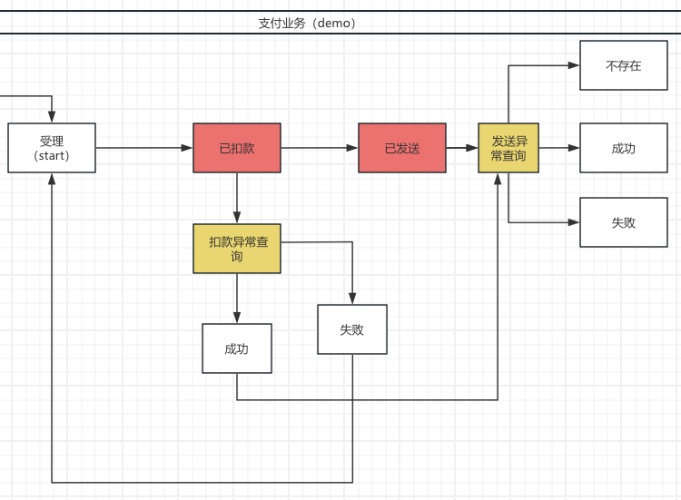
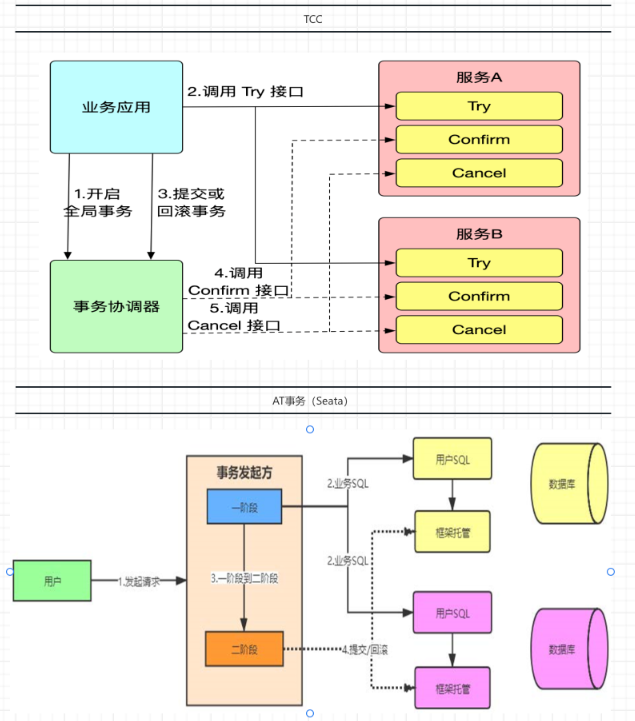
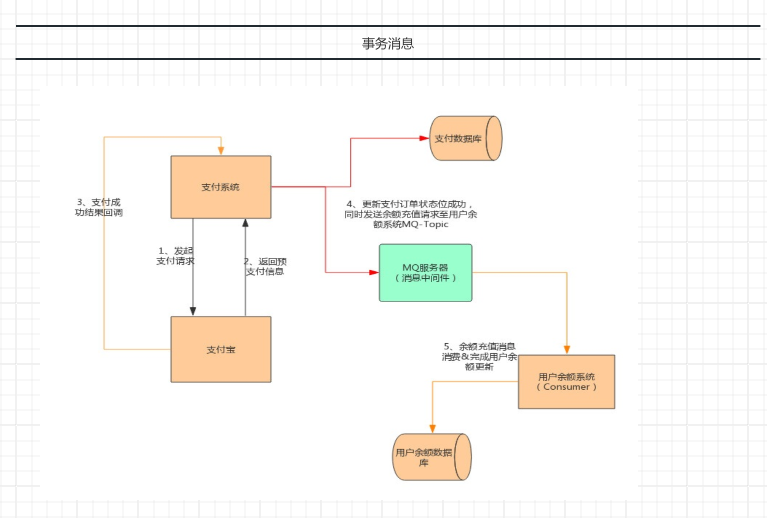
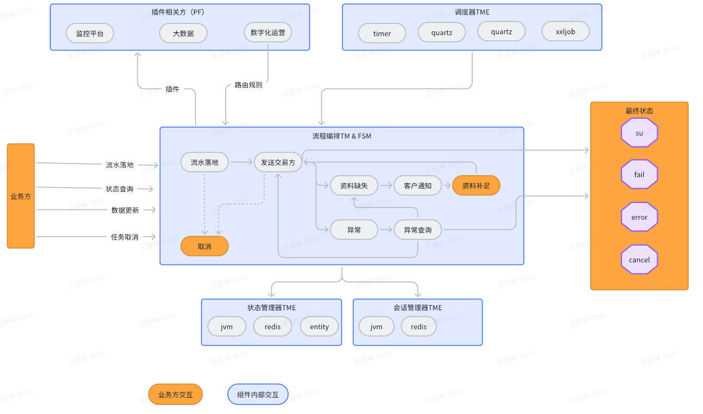

# Saga事务

# quickstart

## 0 场景

## 1 流程编排


``` java 
    @Override
    public Map<PayState, FlowStatus> nodes() {
        Map<PayState, FlowStatus> map = new HashMap<>();
        map.put(PayState.init, FlowStatus.INIT);
        map.put(PayState.payed, FlowStatus.RUNNABLE);
        map.put(PayState.sended, FlowStatus.RUNNABLE);
        map.put(PayState.payed_failover, FlowStatus.RUNNABLE);
        map.put(PayState.sended_failover, FlowStatus.RUNNABLE);
        map.put(PayState.su, FlowStatus.FINISH);
        map.put(PayState.fail, FlowStatus.FINISH);
        map.put(PayState.error, FlowStatus.FINISH);
        return map;
    }
    @Override
    public void transitions(Transitions<PayState> t) {
//        payAction:执行本地扣款
        t.saga(PayState.init, Coasts.EVENT_DEFAULT, Sets.newSet(PayState.init), PayState.payed_failover, "payAction", "payRouter")
                //本地扣款容错payQueryAction 扣款结果查询
                .router(PayState.payed_failover, Coasts.EVENT_DEFAULT, "payQueryAction", "payRouter")
                //发送异常，不明确是否发送
                .saga(PayState.payed, Coasts.EVENT_DEFAULT, Sets.newSet(PayState.payed), PayState.sended_failover, "sendAction", "sendRouter")
                .router(PayState.sended_failover, Coasts.EVENT_DEFAULT, "sendQueryAction", "sendRouter")
                //sendAction，执行远程发生&sendQueryAction。
                .router(PayState.sended, Coasts.EVENT_DEFAULT, "sendQueryAction", "sendRouter");
    }

```


详细  [编排代码](example/src/main/java/cn/hz/ddbm/pc/example/PayFsm.java)

## 2 混沌验证

## 3 逻辑实现


# 事务实现机制选型


1. 数据压力不大，本地事务是最优解
2. 分布式架构下，事务消息&SAGA事务是唯2可用的解，其他有硬伤
3. 业务复杂度很高，业务变化很快、业务很复杂，SAGA事务（即基于流程编排的事务）是唯一解。

# 最佳实践

1. 长业务可拆分为N个短业务的组合，长事务可拆分为N个短事务的组合
2. 每个短事务应该只包含一个变化
3. 事务操作，容错优先
4. 非冥等业务（事务业务），可包装为条件执行的冥等业务
5. 短业务标准化、积木化
6. 长业务编排化
7. 流程编排的关键包含两个：一致性&副作用控制

# 事务实现原理比较



