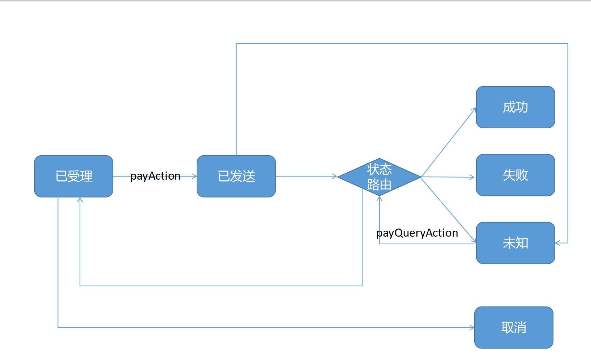
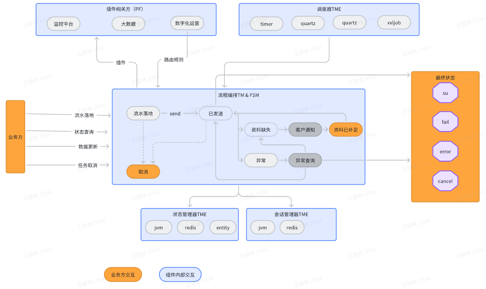
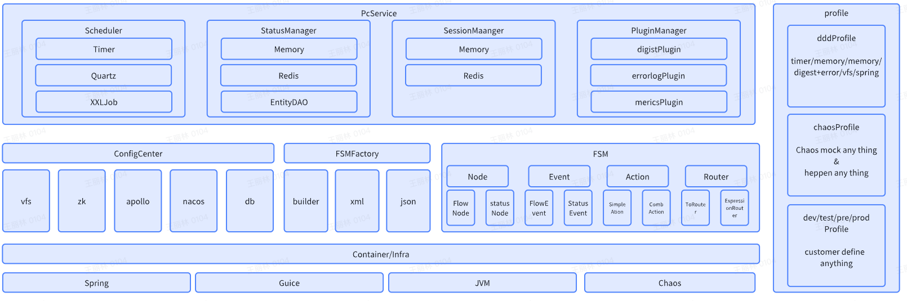
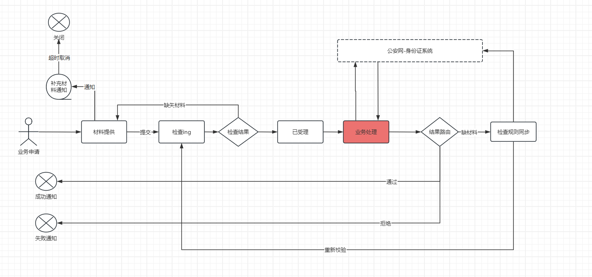

# 流程编排

pc ：轻量级、高性能、高可靠的流程编排框架。

流程编排：一种关注点分离的架构组件。参见[功能：关注点分离](#功能)

# 问题

核心业务，流程长，数据一致性要求高、健壮性要求高、需求变化又比较频繁。

1，如何保证复杂长流程业务的一致性

2，如何保证复杂长流程业务的鲁棒性

3，如何保证复杂长流程业务的灵活性

在架构上，存在不存在一种解决方案，能同时满足这三者？

# 分析

解决这种需求的技术，就是所谓的流程编排。

    参见下图：流程编排解决了某一类的流程类架构需求



      备注
      liteflow，ssm，cola等流程编排技术更接近于状态机——除了具备5（流程构建器）。流程编排的核心能力分布式任务重试、
      调度机制管理、状态管理、一致性……等都依赖应用自身去实现。不算是完全的流程编排。
      
      netflix的Maestro/Conductor则比较重量级，偏重于微服务编排。而不是流程步骤编排。 性能会比较差，但灵活性会比较强。
      介于工作流和流程编排之间。

# quickstart


**代码**

        <dependency>
            <groupId>cn.hz.ddbm.pc</groupId>
            <artifactId>pc</artifactId>
            <version>0.0.1-SNAPSHOT</version>
        </dependency>

参见hz.ddbm.jfsm.pay包

 ```java
package cn.hz.ddbm.pc.example;

import cn.hz.ddbm.pc.core.Flow;
import cn.hz.ddbm.pc.core.Plugin;
import cn.hz.ddbm.pc.core.Profile;
import cn.hz.ddbm.pc.core.coast.Coasts;
import cn.hz.ddbm.pc.core.router.ExpressionRouter;
import cn.hz.ddbm.pc.core.support.Container;
import cn.hz.ddbm.pc.core.support.SessionManager;
import cn.hz.ddbm.pc.core.support.StatusManager;
import cn.hz.ddbm.pc.core.utils.InfraUtils;
import cn.hz.ddbm.pc.factory.buider.StateMachineBuilder;
import cn.hz.ddbm.pc.factory.buider.StateMachineConfig;
import org.slf4j.Logger;
import org.slf4j.LoggerFactory;

import java.util.*;

public class PcConfig implements StateMachineConfig<PcConfig.PcState> {
  Logger logger = LoggerFactory.getLogger(getClass());

  public enum PcState {
    init("初始化"), sended("已发送"), send_failover("发送错误"), miss_data("客户资料缺乏"), miss_data_fulled("客户资料已补"), su("成功"), fail("失败"), error("异常");

    private final String descr;

    PcState(String descr) {
      this.descr = descr;
    }
  }

  public Flow build(Container container) throws Exception {
    StateMachineBuilder.Builder<PcState> builder = StateMachineBuilder.builder(this);
    logger.info("构建订单状态机");

    builder.withStates()
            .initial(PcState.init)
            .ends(PcState.su, PcState.fail, PcState.error)
            .states(EnumSet.allOf(PcState.class))
    ;

    builder.withTransitions()
            .router(PcState.init, Coasts.EVENT_DEFAULT, "sendAction", "sendRouter", null)
            //发送异常，不明确是否发送
            .router(PcState.send_failover, Coasts.EVENT_DEFAULT, "sendQueryAction", "sendRouter", null)
            //已发送，对方处理中
            .router(PcState.sended, Coasts.EVENT_DEFAULT, "sendQueryAction", "sendRouter", null)
            //校验资料是否缺失&提醒用户  & ==》依然缺，已经补充
            .router(PcState.miss_data, Coasts.EVENT_DEFAULT, "validateAndNotifyUserAction", "notifyRouter", null)
//                资料就绪状态，可重新发送
            .to(PcState.miss_data_fulled, Coasts.EVENT_DEFAULT, "", PcState.init)
    //用户上传资料  && 更新资料状态
//                .to(PcState.miss_data, "uploade", "", "miss_data")
    ;

    builder.withRouters()
//                .register("simpleRouter", new ExpressionRouter(new HashMap<>()))
            .register(new ExpressionRouter("sendRouter",
                    new ExpressionRouter.NodeExpression("sendRouter", "Math.random() < 0.1"),
                    new ExpressionRouter.NodeExpression("su", "Math.random() < 0.6"),
                    new ExpressionRouter.NodeExpression("init", "Math.random() < 0.1"),
                    new ExpressionRouter.NodeExpression("fail", "Math.random() < 0.2")
            ))
            .register(new ExpressionRouter("notifyRouter",
                    new ExpressionRouter.NodeExpression("notifyRouter", "Math.random() <0.1"),
                    new ExpressionRouter.NodeExpression("su", "Math.random() < 0.6"),
                    new ExpressionRouter.NodeExpression("init", "Math.random() < 0.1"),
                    new ExpressionRouter.NodeExpression("fail", "Math.random() < 0.2")
            ))
    ;

    return builder.build();
  }

  @Override
  public List<Plugin> plugins() {
    return new ArrayList<Plugin>();
  }

  @Override
  public SessionManager sessionManager() {
    return InfraUtils.getSessionManager(Coasts.SESSION_MANAGER_MEMORY);
  }

  @Override
  public StatusManager statusManager() {
    return InfraUtils.getStatusManager(Coasts.STATUS_MANAGER_MEMORY);
  }

  @Override
  public Map<String, Object> attrs() {
    return new HashMap<>();
  }


  public String machineId() {
    return "test";
  }

  @Override
  public String describe() {
    return "test";
  }

}


@Test
public void pc() throws Exception {
    AnnotationConfigApplicationContext ctx = new AnnotationConfigApplicationContext();
    ctx.register(PcDemo.class);
    ctx.refresh();
    PcConfig pcConfig = new PcConfig();
    Flow     flow     = pcConfig.build(null);
    String   event    = Coasts.EVENT_DEFAULT;
    chaosService.addFlow(flow);
  
    try {
      chaosService.execute("test", new PayloadMock(flow.getInit().getName()), event, 100, 10);
    } catch (Exception e) {
      e.printStackTrace();
    }
}

 ```

**测试**

    17:06:18.828 [pool-1-thread-2] INFO flow - 流程已结束：test,52f795d3-de26-40d1-bdb4-5b0f89a601fc,su
    17:06:18.828 [pool-1-thread-20] INFO flow - 流程已结束：test,52f795d3-de26-40d1-bdb4-5b0f89a601fc,su
    17:06:18.827 [pool-1-thread-7] INFO flow - 流程已结束：test,52f795d3-de26-40d1-bdb4-5b0f89a601fc,su
    17:06:18.829 [pool-1-thread-18] INFO flow - 流程已结束：test,52f795d3-de26-40d1-bdb4-5b0f89a601fc,su
    17:06:18.829 [pool-1-thread-3] INFO flow - 流程已结束：test,52f795d3-de26-40d1-bdb4-5b0f89a601fc,su
    17:06:18.829 [pool-1-thread-13] INFO flow - 流程已结束：test,52f795d3-de26-40d1-bdb4-5b0f89a601fc,fail
    17:06:18.829 [pool-1-thread-1] INFO flow - 流程已结束：test,52f795d3-de26-40d1-bdb4-5b0f89a601fc,su
    17:06:18.829 [pool-1-thread-9] INFO flow - 流程已结束：test,52f795d3-de26-40d1-bdb4-5b0f89a601fc,su
    17:06:18.831 [pool-1-thread-3] INFO flow - 流程已限流：test,52f795d3-de26-40d1-bdb4-5b0f89a601fc,init,52>1
    java.lang.RuntimeException: no router result for status:init
    at cn.hz.ddbm.pc.core.router.ExpressionRouter.route(ExpressionRouter.java:46)
    at cn.hz.ddbm.pc.core.AtomExecutor.execute(AtomExecutor.java:53)
    at cn.hz.ddbm.pc.core.Flow.execute(Flow.java:156)
    at cn.hz.ddbm.pc.profile.PcService.execute(PcService.java:47)
    at cn.hz.ddbm.pc.profile.ChaosPcService.standalone(ChaosPcService.java:80)
    at cn.hz.ddbm.pc.profile.ChaosPcService.lambda$execute$0(ChaosPcService.java:40)
    at java.util.concurrent.Executors$RunnableAdapter.call(Executors.java:511)
    at java.util.concurrent.FutureTask.run(FutureTask.java:266)
    at java.util.concurrent.ThreadPoolExecutor.runWorker(ThreadPoolExecutor.java:1149)
    at java.util.concurrent.ThreadPoolExecutor$Worker.run(ThreadPoolExecutor.java:624)
    at java.lang.Thread.run(Thread.java:750)
    17:06:18.829 [pool-1-thread-4] ERROR error - test,52f795d3-de26-40d1-bdb4-5b0f89a601fc
    
            …………
    17:06:18.836 [main] INFO flow - 混沌测试报告：\n
    17:06:18.837 [main] INFO flow - FlowContext,PAUSE:sendRouter,2
    17:06:18.837 [main] INFO flow - FlowContext,RUNNABLE:sendRouter,3
    17:06:18.837 [main] INFO flow - FlowContext,PAUSE:init,30
    17:06:18.837 [main] INFO flow - FlowContext,RUNNABLE:init,5
    17:06:18.837 [main] INFO flow - FlowContext,RUNNABLE:fail,4
    17:06:18.837 [main] INFO flow - FlowContext,RUNNABLE:su,56
   
# 功能

* 1，积木化功能开发
* 2，技术和业务分离
    * 日志、监控埋点、指标埋点，事件通知 ……通过插件插入。
* 4，最终一致性（saga)
* 5，高性能（分布式事务所有实现中最高）
* 6，混沌
    * 通过混沌接口，模拟各种异常发生的概率，给出流程的鲁邦性报表和优化建议。
    * chaosAction，chaosRouter……不依赖于业务action实现。在设计阶段快速完成设计闭环。
* 7，关注点分离
    * 架构关注点：可读、可维护性、可扩展性、鲁棒性、高可用、一致性、高性能
    * 管理关注点：积木化、工程可管理性、风险可控
    * 开发关注点：明确的功能和边界，依赖，输出
    * 运维关注点：监控、日志
    * 大数据关注点：埋点、ab
    * 数字化运营关注点：指标，ROI，步骤环节、动态运营

# 架构介绍



# 能力词典




 

 


 


