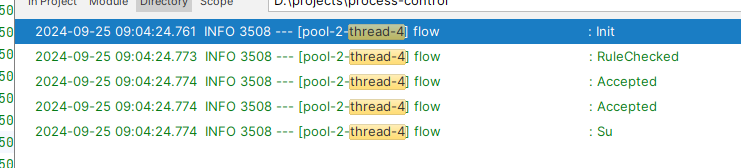

# 简介

**流程编排：积木化组装复杂、长流程业务**

您将获得如下好处

1. 业务能力组件化
2. 低耦合、变更友好
3. 随需而变、灵活组装
4. 一致性，Saga事务
5. 高性能
6. 流程和业务分离；纲举目张
7. 高可读、可维护

# 快速使用

## 引入pom

        <dependency>
            <groupId>cn.hz.ddbm.pc</groupId>
            <artifactId>framework</artifactId>
            <version>${pc.version}</version>
        </dependency>

## 编排业务
    
    这是一个小例子（身份证办理），旨在演示一个比较复杂的流程，用流程编排是如何实现的。

     @Override
    public List<Tetrad<IdCard, String, Class<? extends FsmAction>, Router<IdCard>>> transitions() {
        return Lists.newArrayList(
                Tetrad.of(IdCard.Init, "push", MaterialCollectionAction.class, new ToRouter<>(IdCard.RuleChecked)),
                Tetrad.of(IdCard.RuleChecked, "push", RuleCheckedAction.class, new Router<>(new RowKeyTable<String, IdCard,Double>() {{
                    put("result.code==0000", IdCard.Accepted,0.9);
                    put("result.code==0008", IdCard.Init,0.1);
                }})),
                Tetrad.of(IdCard.Accepted, "push", SendBizAction.class, new Router<>(
                        new RowKeyTable<String, IdCard,Double>() {{
                            put("result.code==0002", IdCard.RuleSyncing,0.1);
                            put("result.code==0003", IdCard.Accepted,0.1);
                            put("result.code==0000", IdCard.Su,0.7);
                            put("result.code==00001", IdCard.Fail,0.1);
                        }})),
                Tetrad.of(IdCard.RuleSyncing, "push", SendBizAction.class, new Router<>(
                        new RowKeyTable<String, IdCard,Double>() {{
                            put("result.code==0000", IdCard.RuleChecked,0.9);
                            put("result.code==0009", IdCard.RuleSyncing,0.1);
                        }})
                )
        );
    }

## 单元测试

    @Test
    public void chaos() throws Exception {
        try {
            //执行100次，看结果分布概率
            chaosService.chaos("idcard",
                    new ChaosService.MockPayLoad(new FsmState(IdCard.Init, FsmWorker.Offset.task)),
                        //执行100次
                    new ChaosConfig(true, 1, 100, 1000));
        } catch (Exception e) {
            e.printStackTrace();
        }
    }

## 运行
    
    2024-09-25 09:04:23.943  INFO 3508 --- [           main] cn.hz.ddbm.pc.fsm.IdCardTest             : No active profile set, falling back to 1 default profile: "default"
    2024-09-25 09:04:24.436  INFO 3508 --- [           main] cn.hz.ddbm.pc.fsm.IdCardTest             : Started IdCardTest in 0.68 seconds (JVM running for 1.173)
    2024-09-25 09:04:24.761  INFO 3508 --- [pool-2-thread-4] flow                                     : Init
    2024-09-25 09:04:24.761  INFO 3508 --- [pool-2-thread-9] flow                                     : Init
    2024-09-25 09:04:24.761  INFO 3508 --- [pool-2-thread-3] flow                                     : Init
    2024-09-25 09:04:24.761  INFO 3508 --- [ool-2-thread-10] flow                                     : Init
    2024-09-25 09:04:24.761  INFO 3508 --- [pool-2-thread-1] flow                                     : Init
    2024-09-25 09:04:24.761  INFO 3508 --- [pool-2-thread-8] flow                                     : Init
    2024-09-25 09:04:24.761  INFO 3508 --- [pool-2-thread-6] flow                                     : Init
    2024-09-25 09:04:24.761  INFO 3508 --- [pool-2-thread-2] flow                                     : Init
    2024-09-25 09:04:24.761  INFO 3508 --- [pool-2-thread-7] flow                                     : Init
    2024-09-25 09:04:24.761  INFO 3508 --- [pool-2-thread-5] flow                                     : Init
    2024-09-25 09:04:24.773  INFO 3508 --- [pool-2-thread-6] flow                                     : RuleChecked
    2024-09-25 09:04:24.773  INFO 3508 --- [pool-2-thread-8] flow                                     : RuleChecked
    2024-09-25 09:04:24.773  INFO 3508 --- [pool-2-thread-3] flow                                     : RuleChecked
    2024-09-25 09:04:24.773  INFO 3508 --- [pool-2-thread-9] flow                                     : RuleChecked
    2024-09-25 09:04:24.773  INFO 3508 --- [pool-2-thread-1] flow                                     : RuleChecked
    2024-09-25 09:04:24.773  INFO 3508 --- [pool-2-thread-7] flow                                     : RuleChecked
    2024-09-25 09:04:24.773  INFO 3508 --- [pool-2-thread-9] flow                                     : Accepted
    2024-09-25 09:04:24.773  INFO 3508 --- [pool-2-thread-5] flow                                     : RuleChecked
    2024-09-25 09:04:24.773  INFO 3508 --- [pool-2-thread-3] flow                                     : Init
    2024-09-25 09:04:24.773  INFO 3508 --- [ool-2-thread-10] flow                                     : RuleChecked
    2024-09-25 09:04:24.773  INFO 3508 --- [pool-2-thread-7] flow                                     : Accepted
    2024-09-25 09:04:24.773  INFO 3508 --- [pool-2-thread-3] flow                                     : RuleChecked
    2024-09-25 09:04:24.773  INFO 3508 --- [pool-2-thread-5] flow                                     : Accepted
    2024-09-25 09:04:24.773  INFO 3508 --- [ool-2-thread-10] flow                                     : Accepted
    2024-09-25 09:04:24.773  INFO 3508 --- [pool-2-thread-8] flow                                     : Accepted
    2024-09-25 09:04:24.773  INFO 3508 --- [pool-2-thread-3] flow                                     : Init
    2024-09-25 09:04:24.773  INFO 3508 --- [pool-2-thread-4] flow                                     : RuleChecked
    2024-09-25 09:04:24.773  INFO 3508 --- [ool-2-thread-10] flow                                     : Accepted
    2024-09-25 09:04:24.773  INFO 3508 --- [pool-2-thread-7] flow                                     : Accepted
    2024-09-25 09:04:24.773  INFO 3508 --- [pool-2-thread-8] flow                                     : Accepted
    2024-09-25 09:04:24.774  INFO 3508 --- [pool-2-thread-4] flow                                     : Accepted
    2024-09-25 09:04:24.773  INFO 3508 --- [pool-2-thread-2] flow                                     : RuleChecked
    2024-09-25 09:04:24.773  INFO 3508 --- [pool-2-thread-3] flow                                     : RuleChecked
    2024-09-25 09:04:24.774  INFO 3508 --- [pool-2-thread-4] flow                                     : Accepted
    2024-09-25 09:04:24.773  INFO 3508 --- [pool-2-thread-9] flow                                     : Accepted
    2024-09-25 09:04:24.774  INFO 3508 --- [pool-2-thread-7] flow                                     : RuleSyncing
    2024-09-25 09:04:24.774  INFO 3508 --- [pool-2-thread-7] flow                                     : RuleSyncing
    2024-09-25 09:04:24.774  INFO 3508 --- [pool-2-thread-5] flow                                     : Accepted
    2024-09-25 09:04:24.774  INFO 3508 --- [pool-2-thread-9] flow                                     : Su
    2024-09-25 09:04:24.774  INFO 3508 --- [pool-2-thread-6] flow                                     : Accepted
    2024-09-25 09:04:24.774  INFO 3508 --- [pool-2-thread-5] flow                                     : Su
    2024-09-25 09:04:24.774  INFO 3508 --- [pool-2-thread-6] flow                                     : Accepted
    2024-09-25 09:04:24.774  INFO 3508 --- [pool-2-thread-4] flow                                     : Su
    2024-09-25 09:04:24.774  INFO 3508 --- [pool-2-thread-1] flow                                     : Accepted
    2024-09-25 09:04:24.774  INFO 3508 --- [pool-2-thread-8] flow                                     : Su
    2024-09-25 09:04:24.774  INFO 3508 --- [pool-2-thread-1] flow                                     : Accepted
    2024-09-25 09:04:24.774  INFO 3508 --- [ool-2-thread-10] flow                                     : Su
    2024-09-25 09:04:24.775  INFO 3508 --- [pool-2-thread-2] flow                                     : Init
    2024-09-25 09:04:24.775  INFO 3508 --- [pool-2-thread-1] flow                                     : Su
    2024-09-25 09:04:24.774  INFO 3508 --- [pool-2-thread-6] flow                                     : Fail
    2024-09-25 09:04:24.774  INFO 3508 --- [pool-2-thread-3] flow                                     : Accepted
    2024-09-25 09:04:24.775  INFO 3508 --- [pool-2-thread-3] flow                                     : Accepted
    2024-09-25 09:04:24.775  INFO 3508 --- [pool-2-thread-3] flow                                     : RuleSyncing
    2024-09-25 09:04:24.775  INFO 3508 --- [pool-2-thread-3] flow                                     : RuleSyncing
    2024-09-25 09:04:24.775  INFO 3508 --- [pool-2-thread-3] flow                                     : RuleChecked
    2024-09-25 09:04:24.775  INFO 3508 --- [pool-2-thread-3] flow                                     : Accepted
    2024-09-25 09:04:24.776  INFO 3508 --- [pool-2-thread-2] flow                                     : RuleChecked
    2024-09-25 09:04:24.776  INFO 3508 --- [pool-2-thread-2] flow                                     : Init
    2024-09-25 09:04:24.776  INFO 3508 --- [pool-2-thread-2] flow                                     : RuleChecked
    2024-09-25 09:04:24.776  INFO 3508 --- [pool-2-thread-2] flow                                     : Accepted
    2024-09-25 09:04:24.776  INFO 3508 --- [pool-2-thread-7] flow                                     : RuleChecked
    2024-09-25 09:04:24.776  INFO 3508 --- [pool-2-thread-2] flow                                     : Accepted
    2024-09-25 09:04:24.776  INFO 3508 --- [pool-2-thread-7] flow                                     : Accepted
    2024-09-25 09:04:24.776  INFO 3508 --- [pool-2-thread-7] flow                                     : Accepted
    2024-09-25 09:04:24.776  INFO 3508 --- [pool-2-thread-2] flow                                     : Su
    2024-09-25 09:04:24.777  INFO 3508 --- [pool-2-thread-7] flow                                     : Su
    2024-09-25 09:04:24.776  INFO 3508 --- [pool-2-thread-3] flow                                     : Accepted
    2024-09-25 09:04:24.777  INFO 3508 --- [pool-2-thread-3] flow                                     : Su
    2024-09-25 09:04:24.778  INFO 3508 --- [           main] flow                                     : 混沌测试报告：\n
    2024-09-25 09:04:24.779  INFO 3508 --- [           main] flow                                     : Su,	9
    2024-09-25 09:04:24.779  INFO 3508 --- [           main] flow                                     : Fail,	1

查看某个的执行结果

 