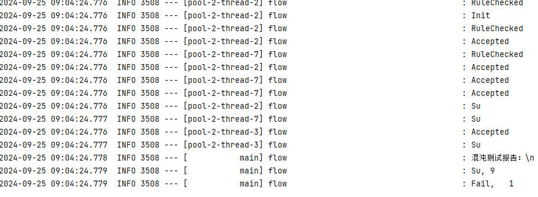

# 简要介绍
    
        大多数软件公司的软件质量都是相当差的。业内管这个叫技术债。
    
        有没有办法解决呢？
    
        有。至少这一类系统有。
        
        这一类系统叫做业务流程系统，就是一条业务报文跑到底，流程很长，中间逻辑很复杂，业务变化很多。
    
        解决这一类系统的核心组件就是：流程编排。
    
        核心思想是
        1，复杂流程可以拆分为N个积木组件（action）
        2，拆分的粒度是状态，从a状态变迁到b状态，中间走actionAB。则ACTION试做一个积木组件。
        3，所有组件的入参和出参都一样，通过流程编排文件组装出复杂流程，组件之间彼此无耦合。
        4，流程编排文件可发布到配置中心，实现流程本身的配置化
        5，aciton组件支持servless引擎，实现组件逻辑的配置化。

        好处是
        1，一个流程文件，轻松掌握一条业务线
        2，流程文件管理，轻松掌控一个系统N个业务线
        3，业务变更有好
        

# 如何评价流程编排组件

 市面上，流程编排组件其实不算多，liteflow，smartflow等等，我觉得都不好。
        
    1，有没有完成流程变化可配置
    2，有没有完成业务逻辑积木化解耦
    3，有没有支持动态指令定义（控制从状态a到状态b还是c的指令）
    4，有没有支持saga事物（对金融是刚需）
    5，有没有支持状态管理（大部分都不支持，支持就会产生业务耦合和一致性问题，有一定的风险）
    6，有没有实现不同人员角色关注点分离 
    7，有没有实现非业务功能插件化，可插拔
    8，上下文有没有集成状态感知和路由，支持数字化运营
     

等待这个组件完善把。
 

# 功能

    1，图形化界面，流程设计和流程运行  
            TODO 优先级不高
    2，节点转化率配置和统计
            参见混沌chaos代码。基本完成，待完善。
    3，节点失败率配置和统计
            参见混沌chaos代码。基本完成，待完善。
    4，流程版本管理
            参见8，利用他实现
    5，接口路由
              
    6，精细化切流

            已支持
    7，混沌

            已支持，有助于业务，架构，开发，管理关注点分离。

    8，流程配置化，动态变更
            TODO，优先级不高，后续集成配置中心，动态发布。
    9，状态管理   已完成100%
        1.  流程状态
                内存/redis/db
        2.  节点状态  
                内存/redis
        3.  上下文 
                内存/redis/db
         
    10，上下文服务化
            TODO 还没想好
    11，SAGA事务
            已完成  100%
    12，重试
            已完成  100%
    13，AbTest

            已完成  100%

    
    14，数字化运行
            已完成  100% （参见插件和业财一体场景）

 