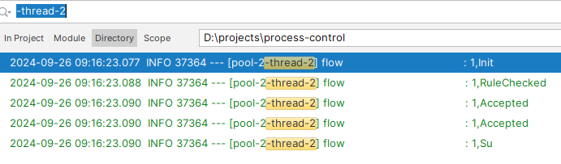

功能

    1，图形化界面，流程设计和流程运行  
            TODO 优先级不高
    2，节点转化率配置和统计
            参见混沌chaos代码。基本完成，待完善。
    3，节点失败率配置和统计
            参见混沌chaos代码。基本完成，待完善。
    4，流程版本管理
            参见8，利用他实现
    5，接口路由
              
    6，精细化切流

            已支持
    7，混沌

            已支持，有助于业务，架构，开发，管理关注点分离。

    8，流程配置化，动态变更
            TODO，优先级不高，后续集成配置中心，动态发布。
    9，状态管理   已完成100%
        1.  流程状态
                内存/redis/db
        2.  节点状态  
                内存/redis
        3.  上下文 
                内存/redis/db
         
    10，上下文服务化
            TODO 还没想好
    11，SAGA事务
            已完成  100%
    12，重试
            已完成  100%
    13，AbTest

            已完成  100%

    
    14，数字化运行
            已完成  100% （参见插件和业财一体场景）

 